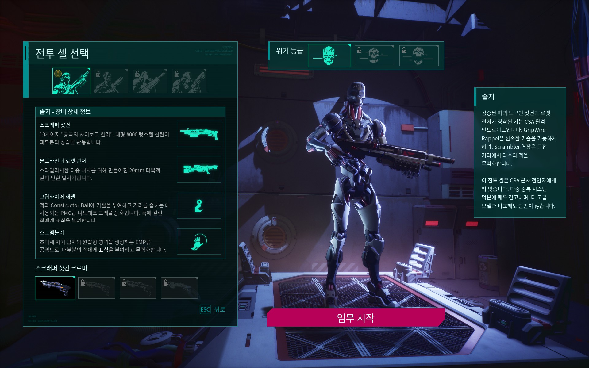
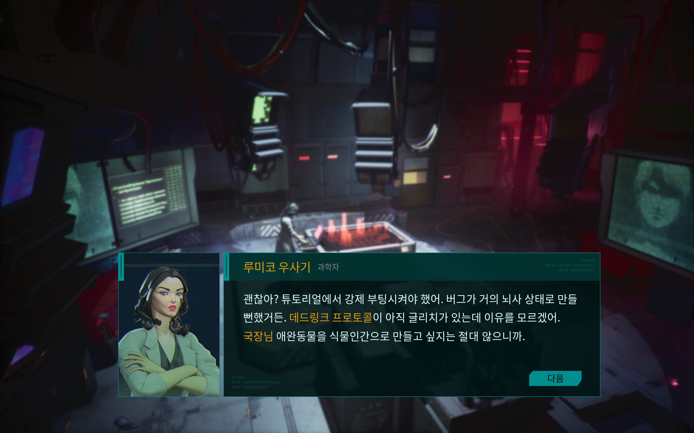
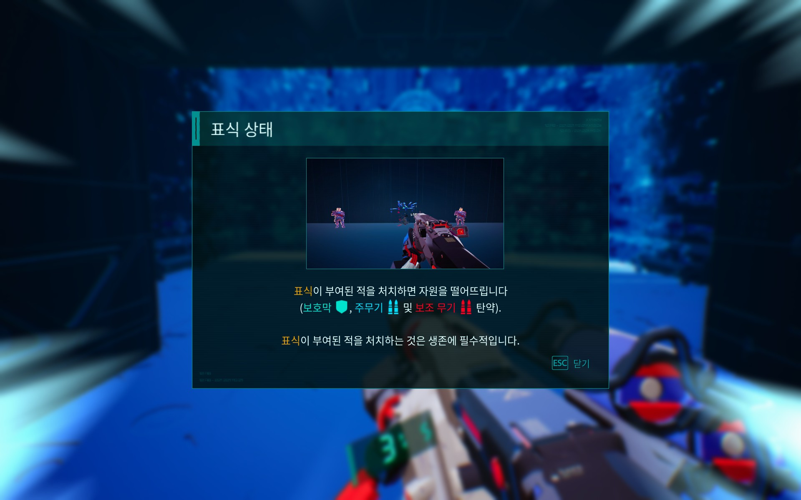
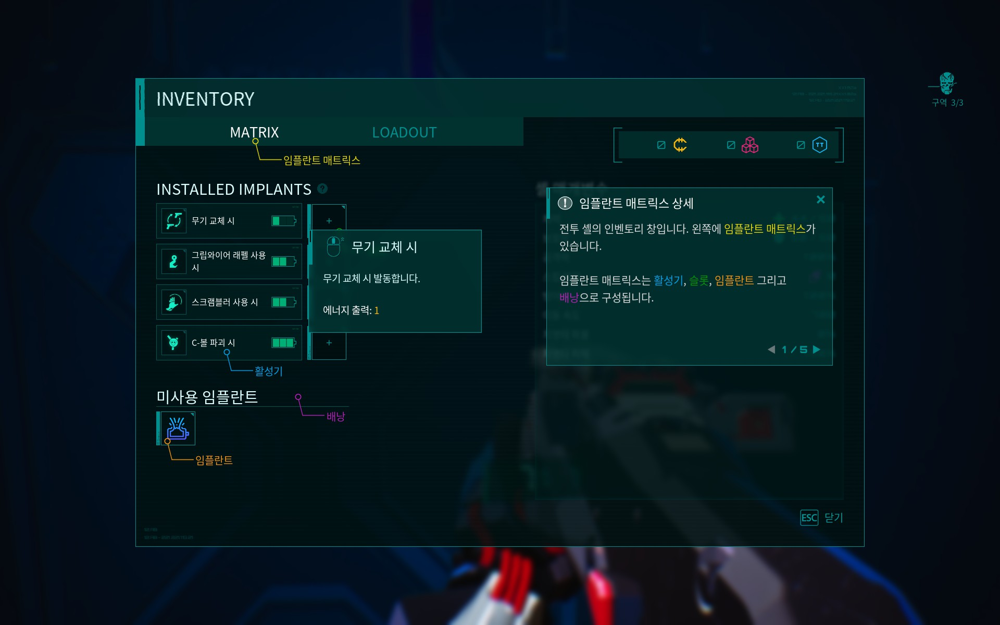
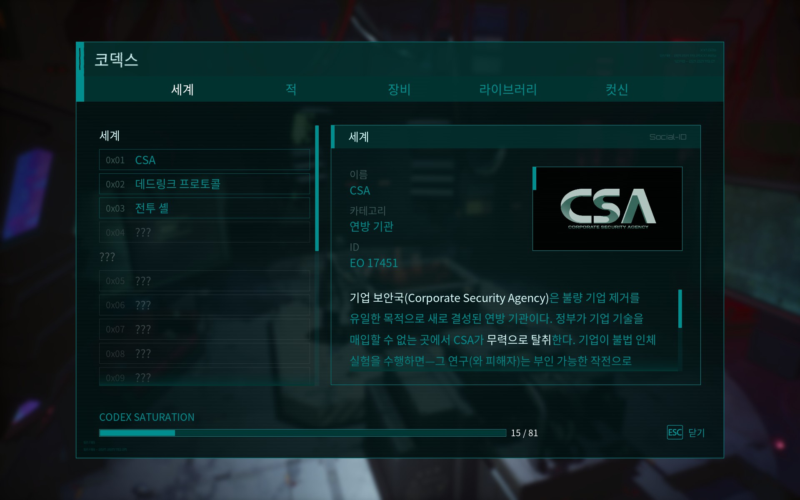
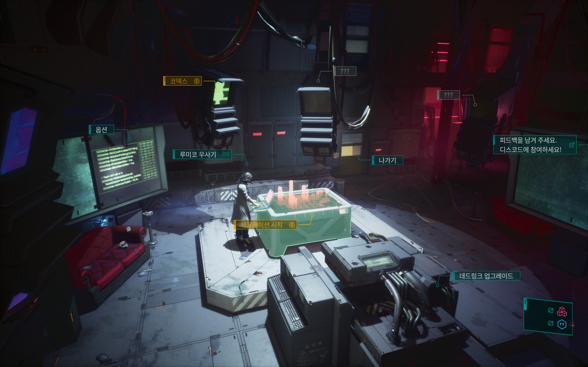

# Deadlink 한글패치 v1.0

> 공식 한국어 지원이 없는 Deadlink의 비공식 한글패치입니다.

---

## 📸 스크린샷

| | |
|---|---|
|  |  |
|  |  |
|  |  |

---

## 📋 번역 범위

| 분류 | 항목 수 | 상태 |
|------|--------|------|
| UI / 메뉴 / 스킬 / 무기 | 1,661 | ✅ 완료 |
| 코덱스 (세계관 문서) | 188 | ✅ 완료 |
| 대화 | 446 | ✅ 완료 |
| 자막 | 250 | ✅ 완료 |
| **합계** | **2,545개** | ✅ |

---

## 💾 설치 방법

### 필요 조건
- PC (Windows) Steam 버전
- 별도 프로그램 설치 불필요

### 설치 순서

**1단계 - 다운로드**
아래 Releases에서 `zzz_deadlink_korean_P.pak` 다운로드

**2단계 - 파일 복사**
게임 폴더의 Paks 디렉터리에 복사
```
기본 경로: D:\SteamLibrary\steamapps\common\Deadlink\Deadlink\Content\Paks
```

**3단계 - Steam 실행 옵션 설정**
Steam 라이브러리에서 Deadlink 우클릭 → 속성 → 일반 → 실행 옵션에 입력:
```
-culture=ko
```

게임을 실행하면 한국어가 표시됩니다.

---

## ❓ 자주 묻는 질문

**Q. 게임 업데이트 후 번역이 안 돼요**

A. 게임 업데이트에 따라 패치 재설치가 필요할 수 있습니다. GitHub에서 최신 버전을 확인해주세요.

**Q. Steam 파일 무결성 검사 후 번역이 사라졌어요**

A. 무결성 검사는 패치 파일을 삭제하므로, 검사 후 패치를 다시 설치하시면 됩니다.

**Q. 일부 텍스트가 영어로 표시돼요**

A. 고유명사 등 일부 항목은 의도적으로 영어를 유지합니다.

---

## 🔧 기술 정보

- **번역 방식**: Unreal Engine `.locres` / `.locmeta` 파일로 `ko` 로케일 추가, 우선순위 pak (`_P.pak`) 배포
- **폰트**: Noto Sans KR (게임 내장 CJK 폰트 활용)
- **번역 파일 위치**: `Deadlink/Content/Paks/zzz_deadlink_korean_P.pak`
- **지원 버전**: Steam PC (Windows)

---

## 📝 오류 제보 / 기여

번역 오류나 누락된 텍스트는 아래로 알려주세요:
- **Issues**: [GitHub Issues](https://github.com/hanpaemo/deadlink-korean-patch/issues)
- **블로그**: https://hanpaemo.blogspot.com

---

## ❤️ 후원

번역이 도움이 되셨다면 응원 부탁드립니다!
- **Ko-fi**: https://ko-fi.com/hanpaemo

---

## 👤 제작

**한패모** — 인디게임 한글패치 모음
- GitHub: https://github.com/hanpaemo
- 블로그: https://hanpaemo.blogspot.com

---

## ⚖️ 라이선스

이 패치는 팬 제작 비공식 번역입니다.
게임 원작의 저작권은 **Gruby Entertainment**에 있습니다.
상업적 이용을 금지합니다.
